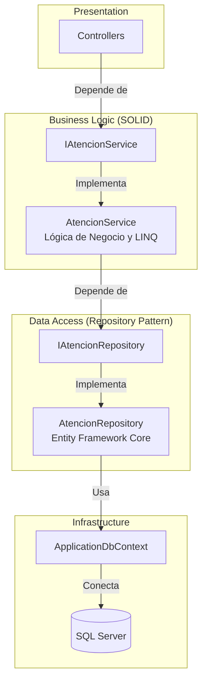

# Backend API - .NET Core 8

> [!info] Fase 2 del Proyecto
> API RESTful aplicando Principios SOLID, Patrón Repository y Separación de Responsabilidades.

## Arquitectura de la Capa Backend

## Principios SOLID Aplicados

| Principio | Implementación en AuditMed |
|-----------|----------------------------|
| **S (Single Responsibility)** | `AtencionRepository` SOLO hace consultas SQL. `AtencionService` SOLO aplica reglas de negocio (LINQ en memoria). |
| **O (Open/Closed)** | Si cambiamos de SQL Server a PostgreSQL, solo creamos un `PostgresAtencionRepository`, el Service no se toca. |
| **L (Liskov Substitution)** | Cualquier clase que implemente `IAtencionRepository` funciona dentro de `AtencionService`. |
| **I (Interface Segregation)** | Interfaces pequeñas (`IAtencionRepository` para datos, `IAtencionService` para negocio). |
| **D (Dependency Inversion)** | El Service no sabe qué es `DbContext`. Depende de `IAtencionRepository` (abstracción). El Controller depende de `IAtencionService`. |

## Trazabilidad de Datos

| Componente | Responsabilidad | Conecta con |
|------------|-----------------|-------------|
| `AtencionesController` | Recibir HTTP | `IAtencionService` |
| `AtencionService` | Reglas LINQ (Filtrado, Cálculo >30 días) | `IAtencionRepository` |
| `AtencionRepository` | `.ToListAsync()`, `.AddAsync()` | `ApplicationDbContext` |

## Volver a
- [[README|Inicio]]
- [[base-de-datos|Fase 1: Base de Datos]]