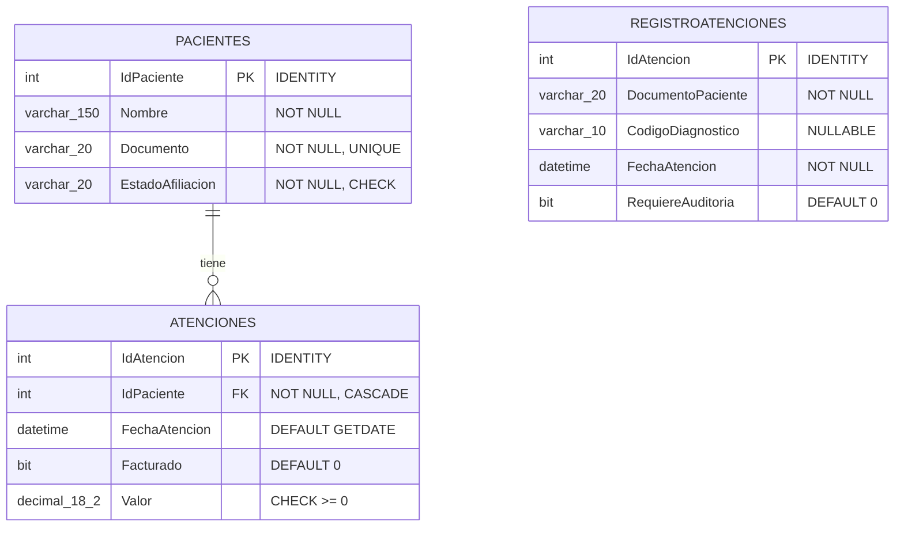

# Base de Datos - AuditMed

> [!info] Fase 1 del Proyecto - Infraestructura Portable
> Modelo de datos desplegado automáticamente con Docker y Flyway.

## Despliegue Automático

Este proyecto utiliza **Docker Compose** para levantar un contenedor de SQL Server 2022 y **Flyway** para ejecutar las migraciones de forma automática y versionada.

```bash
cd database
docker compose up -d
```

### ¿Por qué Docker + Flyway?
- **Portabilidad:** Funciona igual en Windows, Mac o Linux.
- **Reproducibilidad:** Cualquier persona tiene exactamente la misma versión de la BD.
- **Versionado:** Los cambios en la BD se rastrean con Git (`V1__`, `V2__`).
- **Cero dependencias locales:** No requiere instalar SQL Server ni herramientas de cliente.

## Diagrama Entidad-Relación



## Relaciones con Otros Componentes

> [!note] Trazabilidad hacia fases posteriores

| Tabla BD | Clase Backend (Fase 2) | Servicio Frontend (Fase 3) |
|----------|------------------------|----------------------------|
| `RegistroAtenciones` | `RegistroAtencion.cs` | `AtencionService` |
| `RegistroAtenciones` | `AtencionRepository` | `atencion-table.component` |

## Migraciones Flyway

| Archivo | Descripción |
|---------|-------------|
| `V1__creacion_tablas.sql` | Crea estructura (Pacientes, Atenciones, RegistroAtenciones) e índices |
| `V2__datos_prueba.sql` | Inserta datos de prueba para validar la lógica |
| `03-consulta-facturacion.sql` | *No es migración*. Consulta `SELECT` para validación manual del evaluador |

## Volver a
- [[README|Inicio]]